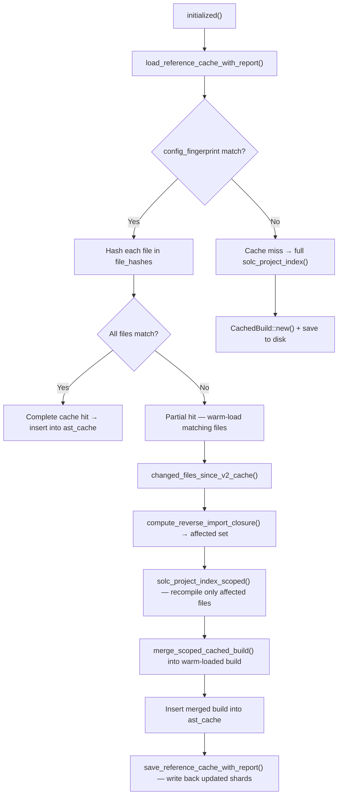

# Caches

This page explains the full cache architecture used by the language server.

## Cache layers

The server uses two layers:

- **In-memory caches**: live state held on `ForgeLsp` behind `Arc<RwLock<…>>`. Used to answer all LSP requests without disk I/O.
- **On-disk cache (v2)**: warm-start data persisted under `.solidity-language-server/`. Allows fast restart without a full recompile.

---

## In-memory caches

All in-memory caches are fields on `ForgeLsp` in `src/lsp.rs`.

### `ast_cache` — the primary index

`Arc<RwLock<HashMap<DocumentUri, Arc<CachedBuild>>>>`

The central store. Two kinds of entries coexist using the same map:

- **Per-file entries** — key is `DocumentUri("file:///…/A.sol")`. Created by `on_change()` after each successful single-file build.
- **Project-level entry** — key is `DocumentUri(project_cache_key())` (the workspace root URI). Created by the background project-index worker. Used for cross-file features (references, rename, goto across files).

Entries are never evicted by age. They are removed explicitly on `didDeleteFiles`, `solidity.clearCache`, `solidity.reindex`, and `initialized()` full-rebuild. A failed build leaves the previous entry intact.

### `text_cache`

`Arc<RwLock<HashMap<DocumentUri, (i32, String)>>>`

Key = `DocumentUri`. Value = `(version, content)`. Stores the live editor buffer text. Updated on `didOpen`, `didChange`, `didSave`. All LSP handlers read from here so they see unsaved edits without a disk read. Version guard: only updates when `incoming_version >= stored_version` to prevent older updates from overwriting newer ones.

### `completion_cache`

`Arc<RwLock<HashMap<DocumentUri, Arc<CompletionCache>>>>`

Key = `DocumentUri`. Populated immediately after a successful build in `on_change()` by sharing the `Arc<CompletionCache>` that was already pre-built inside `CachedBuild::new()`. This is a convenience shortcut so the completion handler can access the completion index without locking the whole `ast_cache`. Evicted on `didDeleteFiles`.

### `semantic_token_cache`

`Arc<RwLock<HashMap<DocumentUri, (String, Vec<SemanticToken>)>>>`

Key = `DocumentUri`. Value = `(result_id, token_list)`. The `result_id` is a monotonically increasing string from `semantic_token_id: Arc<AtomicU64>`. Populated on `textDocument/semanticTokens/full`; used for delta computation on `textDocument/semanticTokens/full/delta`. Evicted on `didDeleteFiles`.

### Process-static: `INSTALLED_VERSIONS`

`static OnceLock<Mutex<Vec<SemVer>>>` in `src/solc.rs`.

Caches the list of solc versions installed by svm-rs. Populated lazily on first access via `get_installed_versions()`. Explicitly invalidated after a successful `svm install` via `invalidate_installed_versions()`. Never visible to LSP clients.

---

## `CachedBuild` — field reference

`CachedBuild` in `src/goto.rs` is the pre-built AST index. The raw solc JSON is consumed in `CachedBuild::new()` and then dropped — nothing is retained in raw form.

| Field | Type | Built by | Purpose |
|---|---|---|---|
| `nodes` | `HashMap<AbsPath, HashMap<NodeId, NodeInfo>>` | `cache_ids()` in `goto.rs` | Two-level map: abs_path → node_id → `NodeInfo`. `AbsPath` is a typed wrapper over path strings. Core of goto-definition, references, rename. |
| `path_to_abs` | `HashMap<RelPath, AbsPath>` | `cache_ids()` | Maps solc-relative path → absolute path. Needed because solc outputs relative keys. |
| `external_refs` | `HashMap<SrcLocation, NodeId>` | `cache_ids()` | `SrcLocation("offset:length:fileId")` → declaration `NodeId` for Yul `externalReferences`. |
| `id_to_path_map` | `HashMap<SolcFileId, String>` | `CachedBuild::new()` | Source file id → relative path. `SolcFileId` wraps the stringified solc id (`"0"`, `"34"`, …). |
| `decl_index` | `HashMap<NodeId, DeclNode>` | `solc_ast::extract_decl_nodes()` | Typed declaration lookup: function, variable, contract, event, error, struct, enum, modifier, UDVT. Keyed by `NodeId`. |
| `node_id_to_source_path` | `HashMap<NodeId, AbsPath>` | `solc_ast::extract_decl_nodes()` | O(1): declaration node id → source file absolute path. Avoids O(N) walk. |
| `gas_index` | `HashMap<GasKey, ContractGas>` | `gas::build_gas_index()` | Key `GasKey("path:ContractName")`. Creation costs and per-function gas by selector/signature. Used by hover and inlay hints. |
| `hint_index` | `HashMap<AbsPath, HintLookup>` | `inlay_hints::build_hint_index()` | Keyed by `AbsPath`. Each `HintLookup` has by-offset and by-`(name, arg_count)` sub-indexes for resolving parameter names at call sites. |
| `doc_index` | `HashMap<DocKey, DocEntry>` | `hover::build_doc_index()` | Merged userdoc/devdoc. Keyed by 4-byte selector, 32-byte event topic, or `"path:Name"`. |
| `completion_cache` | `Arc<CompletionCache>` | `completion::build_completion_cache()` | Full completion index (see below). Wrapped in `Arc` so it can be shared into `ForgeLsp.completion_cache` without cloning. |
| `build_version` | `i32` | Set from LSP document version | The `didChange`/`didOpen` version that produced this build. Used to detect dirty files (`text_version > build_version`). |
| `content_hash` | `u64` | `DefaultHasher` on source text | Hash of the source text at compile time. Compared in `on_change()` to skip rebuilds when content is identical (format-on-save guard). `0` for project-index builds. |

### `NodeInfo` stored per-node

- `src` — `SrcLocation` (`"offset:length:fileId"` string wrapper)
- `name_location` — optional `nameLocation` src for declarations
- `name_locations` — `Vec<String>` for `IdentifierPath`
- `referenced_declaration` — optional declaration node id this node refers to
- `node_type` — e.g. `"FunctionDefinition"`
- `member_location` — for `MemberAccess` expressions
- `absolute_path` — for `ImportDirective` nodes

### Warm-loaded cache limitation

When a `CachedBuild` is reconstructed from the on-disk v2 cache via `from_reference_index()`, only `nodes`, `path_to_abs`, `external_refs`, and `id_to_path_map` are populated. `decl_index`, `gas_index`, `hint_index`, `doc_index`, and `completion_cache` are all empty.

This means after a warm-load, only cross-file goto-definition and references work immediately. Hover docs, parameter inlay hints, gas estimates, and completions are not available until the first full `solc_project_index()` run completes. This is logged at startup and is by design: the warm-load prioritizes low latency for navigation features.

---

## `CompletionCache` — field reference (`src/completion.rs`)

| Field | Purpose |
|---|---|
| `names` | Flat list of all named identifiers (unscoped) |
| `name_to_type` | `SymbolName` → `TypeIdentifier`; used for dot-completion |
| `type_to_node` | `TypeIdentifier` → defining node id |
| `node_members` | struct/contract/enum/library member completion items |
| `name_to_node_id` | `SymbolName` (contract/library/interface name) → node id |
| `method_identifiers` | 4-byte selectors from `evm.methodIdentifiers` |
| `function_return_types` | `(contract_id, fn_name)` → return typeIdentifier (for `foo().`) |
| `using_for` | `TypeIdentifier` → library functions via `using X for T` |
| `using_for_wildcard` | Functions from `using X for *` |
| `general_completions` | Pre-built non-dot completion list (AST names + keywords + globals + units) |
| `scope_declarations` | Declarations per scope node |
| `scope_parent` | Scope tree for upward scope walks |
| `scope_ranges` | All scope byte ranges sorted by span size (innermost-first) |
| `path_to_file_id` | `RelPath` → AST file id (for scope-aware lookup) |
| `linearized_base_contracts` | C3 linearization per contract (for inherited member lookup) |
| `contract_kinds` | `"contract"`, `"interface"`, or `"library"` |
| `top_level_importables_by_name` | Import-on-completion: `SymbolName` → candidates |
| `top_level_importables_by_file` | Same data keyed by `RelPath` (for incremental invalidation) |

---

## On-disk cache (v2)

**Source:** `src/project_cache.rs`

**Location:** `<project_root>/.solidity-language-server/`

### Files

| Path | Content |
|---|---|
| `.solidity-language-server/.gitignore` | `*` — ensures the entire directory is gitignored |
| `.solidity-language-server/solidity-lsp-schema-v2.json` | Main index file (`PersistedReferenceCacheV2`) |
| `.solidity-language-server/reference-index-v2/<keccak256_hex>.json` | One shard per source file (`PersistedFileShardV2`) |

The `.gitignore` is written automatically the first time the cache directory is created.

### Index file schema (`PersistedReferenceCacheV2`)

| Field | Purpose |
|---|---|
| `schema_version` | Must equal `3` to be loaded |
| `project_root` | Absolute path to the project root |
| `config_fingerprint` | Keccak256 of config inputs (see below) |
| `file_hashes` | `BTreeMap<rel_path, keccak256_hex>` — current content hashes at save time |
| `file_hash_history` | `BTreeMap<rel_path, Vec<String>>` — up to 8 historical hashes per file (reserved for future use; not currently read during load) |
| `path_to_abs` | Relative → absolute path map |
| `id_to_path_map` | Source file id → relative path |
| `external_refs` | Yul external reference entries |
| `node_shards` | `BTreeMap<rel_path, shard_filename>` |

### Shard files (`PersistedFileShardV2`)

Each shard stores one source file's node entries:

```json
{
  "abs_path": "/path/to/file.sol",
  "entries": [{ "id": 12345, "info": { "src": "0:100:0", ... } }]
}
```

Shard filename = `keccak256(rel_path_bytes)` as hex + `.json`. All writes use write-to-tmp + `fs::rename()` for atomicity.

---

## Cache invalidation

### Config fingerprint

`config_fingerprint` is a Keccak256 hash of the inputs that affect the reference index. Any change triggers a full cache miss and clean rebuild:

| Input | Why it matters |
|---|---|
| `lsp_version` | Any server binary upgrade rebuilds from scratch |
| `solc_version` | Different compiler → different AST node IDs |
| `remappings` | Affects which files are resolved |
| `evm_version` | Can change which code paths solc parses |
| `sources_dir` / `libs` | Determines the set of source files in scope |
| `via_ir` | Yul IR pipeline can produce different AST node IDs |

Optimizer settings (`optimizer`, `optimizer_runs`) are intentionally excluded — they affect bytecode but not the AST shape or node IDs.

### Per-file content hashes

Each file has an independent Keccak256 content hash in `file_hashes`. A fingerprint match but changed file hash triggers a **scoped reconcile** for only those files, without discarding the whole cache.

### In-memory content hash (`CachedBuild.content_hash`)

Separate from the on-disk hash. Uses `DefaultHasher` (not keccak256) applied to the saved text in `on_change()`. Only used for within-session idempotency: if the incoming text hash matches the last build's hash, the build is skipped entirely. Not used for on-disk cache validation.

---

## Startup (warm load)

On `initialized()`, the server tries to load the v2 cache:



The warm-load `CachedBuild` (from `from_reference_index()`) has only navigation data. After the scoped or full recompile, `decl_index`, `hint_index`, `gas_index`, `doc_index`, and `completion_cache` become available.

---

## During editing: two async workers

On each `didSave`, the server may launch two independent background workers:

### Fast-path upsert worker (350ms debounce)

Drains `project_cache_upsert_files` (the saved file's abs path). Reads the **authoritative root-key `CachedBuild`** from `ast_cache` (the merged build with correctly remapped global file IDs), then calls `upsert_reference_cache_v2_with_report()`:

- Reads and parses the existing index file (for `file_hashes` and `node_shards` of unchanged files).
- Writes only the changed per-file shards.
- Serializes `path_to_abs`, `id_to_path_map`, and `external_refs` directly from the in-memory merged build, ensuring the disk cache always mirrors the authoritative in-memory state.

This keeps the on-disk cache data fresh between full project reindexes without introducing file ID remapping drift.

### Full sync worker (700ms debounce)

Set when `project_cache_dirty` is true (after rename/delete/reindex events). Drains `project_cache_changed_files`, computes `compute_reverse_import_closure()` (files that import the changed files), and runs `solc_project_index_scoped()` to recompile the affected closure. Result is merged and persisted via `save_reference_cache_with_report()`.

**Single-flight guards:** both workers have `_running` / `_pending` atomics so at most one of each runs at a time. If a save arrives while a worker is already running, `_pending` is set and the worker loops once more after finishing before stopping.

---

## Commands

The server exposes two `workspace/executeCommand` commands for cache management. Both are advertised during `initialize`.

### `solidity.clearCache`

Deletes the entire `.solidity-language-server/` directory on disk and wipes the in-memory `ast_cache` entry for the current project root. The next file save or open triggers a clean rebuild from scratch.

Use this when the cache is corrupt, after a major foundry config change, or when you want to verify a fresh index.

**nvim:**
```lua
vim.lsp.buf.execute_command({ command = "solidity.clearCache" })
```

**VS Code / Cursor:**
```ts
vscode.commands.executeCommand("solidity.clearCache");
```

**Helix** (`:lsp-execute-command solidity.clearCache` — requires Helix ≥ 24.03)

Returns `{ "success": true }` on success, or a JSON-RPC `InternalError` if the directory could not be removed.

### `solidity.reindex`

Evicts the in-memory `ast_cache` entry for the current project root and sets `project_cache_dirty` so the background sync worker triggers a fresh scoped index build. The on-disk cache is left intact, so the warm-load will be fast.

**Important:** if no file is saved after calling `solidity.reindex`, no reindex actually runs. The command arms the dirty flag; the sync worker is triggered on the next `didSave`.

**nvim:**
```lua
vim.lsp.buf.execute_command({ command = "solidity.reindex" })
```

**VS Code / Cursor:**
```ts
vscode.commands.executeCommand("solidity.reindex");
```

Returns `{ "success": true }`.

### Comparison

| | `solidity.clearCache` | `solidity.reindex` |
|---|---|---|
| Deletes `.solidity-language-server/` on disk | Yes | No |
| Clears in-memory `ast_cache` | Yes | Yes |
| Triggers background reindex | Yes (from scratch) | Yes (warm from disk) |
| Speed of next index build | Slow (full recompile) | Fast (warm load) |
| Use when | Cache corrupt / config changed | Index feels stale |

---

## Settings that affect cache behavior

Under `projectIndex` in editor settings:

| Setting | Purpose |
|---|---|
| `cacheMode` | `"v2"` or `"auto"` (alias for `"v2"`). V2 is the only active mode. |
| `incrementalEditReindex` | Enable the scoped affected-file reindex path on save |
| `incrementalEditReindexThreshold` | Ratio gate: if affected-file fraction exceeds this, fall back to full reindex |
| `fullProjectScan` | Run a full project index on the first successful single-file build (default: `true`) |

See the setup schema in [Setup Overview](/setup).

---

## Main implementation files

| File | Role |
|---|---|
| `src/goto.rs` | `CachedBuild`, `NodeInfo`, `cache_ids()`, `from_reference_index()` |
| `src/project_cache.rs` | All on-disk v2 persistence: save, load, upsert, shard logic |
| `src/lsp.rs` | Owns all in-memory caches; drives lifecycle via LSP events; both async workers |
| `src/completion.rs` | `CompletionCache`, `build_completion_cache()` |
| `src/inlay_hints.rs` | `HintIndex`, `HintLookup`, `build_hint_index()` |
| `src/hover.rs` | `DocIndex`, `DocEntry`, `build_doc_index()` |
| `src/gas.rs` | `GasIndex`, `ContractGas`, `build_gas_index()` |
| `src/solc.rs` | `INSTALLED_VERSIONS` static cache; `solc_ast()`, `solc_project_index()` |
