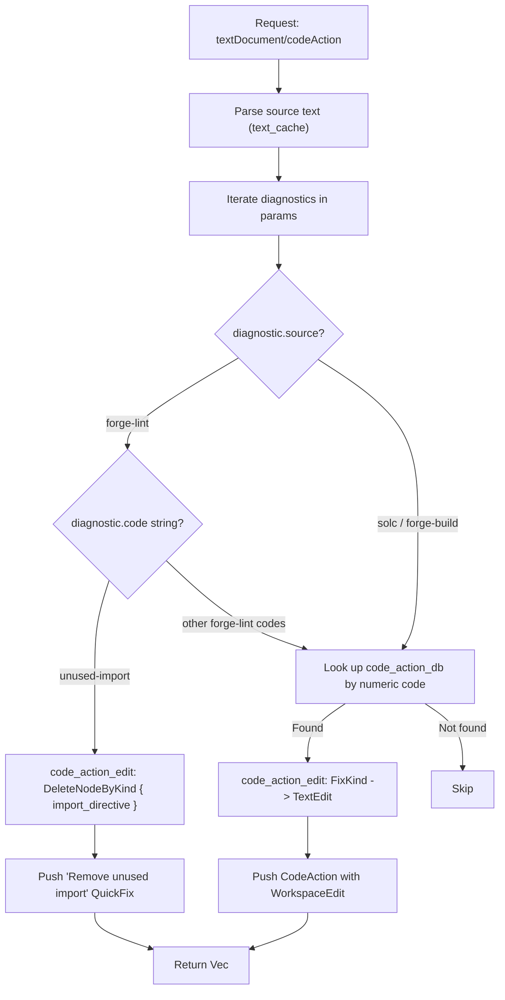

# Code Actions

## What this page covers

This page describes the `textDocument/codeAction` implementation:

- how the action database is structured and loaded,
- how diagnostics are matched to actions at request time,
- the tree-sitter edit helpers used to produce workspace edits,
- what rules are currently handled,
- what is covered by tests today.

## Terms used in this page

- **`CodeActionDef`**: a typed quick-fix definition loaded from `data/error_codes.json` at startup.
- **`FixKind`**: the Rust enum that describes how a fix is applied (insert, replace token, delete node, etc.).
- **`code_action_edit`**: the function in `goto.rs` that takes a `FixKind` + source text + diagnostic range and produces a `TextEdit` by walking the tree-sitter parse tree.
- **`code_action_db`**: the server-wide `Arc<HashMap<ErrorCode, CodeActionDef>>` loaded once at startup and shared across requests.
- **forge-lint string code**: a string identifier used by `forge lint` diagnostics (e.g. `"unused-import"`) — distinct from numeric solc error codes.

## Database design

Action definitions live in `data/error_codes.json`, embedded into the binary at compile time via `include_str!`. This means no runtime I/O and no additional install step for users.

Each entry may carry an optional `"action"` object:

```json
{
  "code": 2072,
  "action": {
    "kind": "delete_node",
    "title": "Remove unused variable",
    "node": "variable_declaration_statement"
  }
}
```

If `"action"` is `null`, no quick-fix is available for that code. At startup, `code_actions::load()` parses the JSON into `HashMap<ErrorCode, CodeActionDef>`, omitting entries with `null` actions.

### Supported `kind` values

| Kind | Description |
|------|-------------|
| `insert` | Insert fixed text at a well-known anchor (currently: `file_start`) |
| `replace_token` | Replace the token at the diagnostic range start (optionally walk up to an ancestor node first) |
| `delete_token` | Delete the token at the diagnostic range start |
| `delete_node` | Walk the tree-sitter tree up to a named node kind and delete the whole node |
| `delete_child_node` | Walk to an ancestor node, then delete the first child matching a list of kinds |
| `replace_child_node` | Walk to an ancestor node, then replace a specific child kind with new text |
| `insert_before_node` | Walk to an ancestor node, then insert text before the first child matching a list of kinds |
| `custom` | No generic fix; handler falls through to a hand-written match arm in `lsp.rs` |

## Runtime flow

At `textDocument/codeAction`, the server iterates over the diagnostics in the request params and matches each to an action:



Forge-lint diagnostics carry string codes (e.g. `"unused-import"`) that are handled by dedicated match arms. Solc/forge-build diagnostics carry numeric codes that are looked up directly in `code_action_db`.

## Tree-sitter edit helpers (`goto.rs`)

`code_action_edit(src, diag_range, kind)` produces an `Option<TextEdit>`:

- Parses the source text with tree-sitter on every call (lightweight, per-request).
- Walks the tree from the node containing the diagnostic range start.
- Applies the `CodeActionKind` edit strategy (delete whole node, replace child, etc.).
- Returns `None` when the required tree node cannot be located.

The `DeleteNodeByKind` variant (used for `unused-import`) finds the smallest ancestor node whose kind matches (e.g. `import_directive`) and deletes the entire line including leading whitespace/newline.

## Registered capability

The server declares `CodeActionProviderCapability::Options` with:

```json
{ "codeActionKinds": ["quickfix"] }
```

Only `QuickFix` kind is advertised. Refactor and other action kinds are not currently registered.

## Currently handled rules

### Forge-lint string codes (hand-written)

| Code string | Action |
|-------------|--------|
| `unused-import` | "Remove unused import" — deletes the `import_directive` node |

### Solc numeric codes (JSON-driven, selection)

| Error code | Action |
|------------|--------|
| 1878 | Add SPDX license identifier |
| 2072 | Remove unused local variable |
| 7359 | Replace `now` with `block.timestamp` |
| 5424 | Add `virtual` to function |
| 4126 | Remove duplicate visibility specifier |
| 1560 / 1159 / 4095 | Change visibility to `external` |
| 8113 | Remove `public` from constructor |
| 9559 / 7708 / 5587 | Mark interface/fallback/receive as `external` |

Full list is in `data/error_codes.json`.

## Main implementation files

| File | Role |
|------|------|
| `src/code_actions.rs` | JSON schema types, `load()`, `FixKind` enum |
| `src/goto.rs` | `code_action_edit`, `CodeActionKind` enum, tree-sitter edit logic |
| `src/lsp.rs` | `code_action` handler — dispatches diagnostics to fixes |
| `data/error_codes.json` | JSON rule table embedded at compile time |

## Test coverage and confidence

`src/code_actions.rs` tests verify:

- `load()` parses without panic and the map is non-empty.
- All explicitly handled numeric codes are present in the map.
- `1878` maps to `FixKind::Insert` with `"SPDX-License-Identifier"` text and `FileStart` anchor.
- `7359` maps to `FixKind::ReplaceToken` with `replacement = "block.timestamp"`.
- `2072` maps to `FixKind::DeleteNode` with `node_kind = "variable_declaration_statement"`.
- `5424` maps to `FixKind::InsertBeforeNode` with `walk_to = "function_definition"` and `text = "virtual "`.
- Codes with `"custom"` kind map to `FixKind::Custom`.
- Codes with `null` action are absent from the map.

### Recommended explicit additions

- Request-level end-to-end test: inject a `forge-lint` diagnostic with code `"unused-import"` and assert the returned `WorkspaceEdit` deletes the correct line.
- Request-level test: inject a solc diagnostic with code `2072` and assert a `delete_node` edit is returned at the correct range.
- Test for `code_action_edit` with `DeleteNodeByKind` on a real source fixture to verify whitespace handling.
