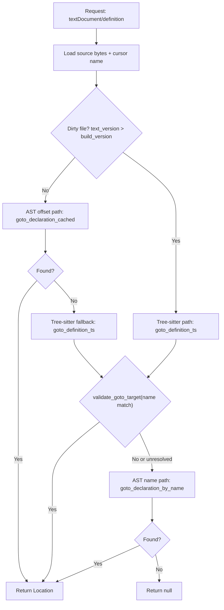

# Go-to-Definition

## Terms used in this page

- **`CachedBuild`**: a group of Rust `HashMap`s created from a successful build on disk. The maps store things like `node id -> node info` and `source id -> file path`. It is a snapshot, not the live editor buffer.
- **`build_version`**: an integer stored with `CachedBuild` that records which text version produced that snapshot.
- **`text_cache`**: an in-memory `HashMap<uri, (version, text)>` with the latest editor-buffer content.
- **Clean**: the in-memory editor text for a file is at the same version as the last cached successful build for that file (`text_version <= build_version`).
- **Dirty**: the in-memory editor text is newer than the cached build (`text_version > build_version`). This usually means unsaved edits or edits not yet reflected in a successful rebuild.
- **AST offset path**: direct declaration lookup using AST `src` byte offsets (`goto_declaration_cached`).
- **Tree-sitter path**: live-buffer parsing and name/scope-based resolution (`goto_definition_ts`).

## Why this design exists

Go-to-definition must work in two very different editor states:

1. **Clean state**: the buffer matches the last successful build.
2. **Dirty state**: the buffer has unsaved or not-yet-built edits.

In the clean state, AST byte offsets are reliable and fast.  
In the dirty state, offsets can drift, so name/scope-based resolution is safer.

This behavior was introduced to address the dirty-buffer reliability issue reported in [#2](https://github.com/mmsaki/solidity-language-server/issues/2).

## Runtime flow

At request time, `textDocument/definition` checks whether the file is clean or dirty, then picks the resolution order.



## End-to-end request path

::::steps
### Determine source of truth (clean vs dirty)
The server compares current text version in `text_cache` to the cached build version.  
If text is newer, the file is treated as dirty and AST byte offsets are considered potentially stale.

### Resolve a candidate from live syntax
For dirty files (and as a fallback for clean files), the server parses the live buffer and builds cursor context (identifier, function scope, contract scope), then resolves scope using cached declaration maps and inheritance order.

Typical context shape:

```text
identifier "totalSupply"
  -> function_definition "mint"
  -> contract_declaration "Token"
```

### Normalize to declaration location
After semantic resolution, the server maps the target to concrete declaration ranges in source, including same-file and cross-file targets. When several matches exist, it prefers the best scoped/overload-compatible target.

### Validate and apply fallback policy
Tree-sitter targets are validated against the cursor identifier text.  
If validation fails in dirty mode, the server falls back to AST-by-name resolution; in clean mode, it tries AST-by-offset first and then tree-sitter fallback.
::::

Once this sequence succeeds, the server returns a single `Location`; otherwise it returns `null`.

## Formatting race guard (related reliability fix)

A separate race was fixed so goto/hover read correct text after formatting:

1. `on_change` only writes to `text_cache` when version is not older than what is already cached.
2. Formatting updates `text_cache` immediately before returning edits.

## Current Behavior Summary

- **Dirty buffers:** tree-sitter path first, then AST-by-name fallback.
- **Clean buffers:** AST-by-offset path first, then tree-sitter fallback.
- **Tree-sitter results are validated** against cursor identifier text before return.
- **Parameter and local declaration navigation** is supported by tree-sitter declaration scanning.

## Reused Infrastructure

| Component | From | Used For |
|-----------|------|----------|
| `CompletionCache` | completion.rs | Scope chain, type resolution, inheritance |
| `scope_declarations` | completion.rs | Name → type mappings per scope |
| `linearized_base_contracts` | completion.rs | C3 inheritance resolution |
| `name_to_node_id` | completion.rs | Contract name → scope ID |
| `text_cache` | lsp.rs | Live buffer content |
| tree-sitter parser | goto.rs | Parse live buffer and find declaration ranges |

## Test Coverage

The goal of tests here is to protect behavior, not specific implementation details.
Even if internals change, these guarantees should still hold:

1. **Cursor context is extracted correctly**
   We must reliably detect identifier, function, and contract context from live syntax.
   Why it matters: wrong context routes resolution to the wrong scope.
   Representative tests:
   - `test_cursor_context_state_var`
   - `test_cursor_context_top_level`
   - `test_cursor_context_short_param`

2. **Declaration discovery finds valid symbol kinds**
   The declaration scanner must return the expected declaration nodes (state vars, params, enum values, etc.).
   Why it matters: if symbol extraction misses a kind, go-to-definition silently fails for that language feature.
   Representative tests:
   - `test_find_declarations`
   - `test_find_declarations_enum_value`
   - `test_cursor_context_short_param`

3. **Ambiguity resolution picks the intended target**
   When multiple declarations share a name, selection logic must prefer the correct scope/container.
   Why it matters: users should not jump to unrelated symbols with the same name.
   Representative tests:
   - `test_find_declarations_multiple_contracts`
   - `test_find_best_declaration_same_contract`

This suite is intentionally tied to these guarantees so refactors can change function names or structure without weakening behavior.
