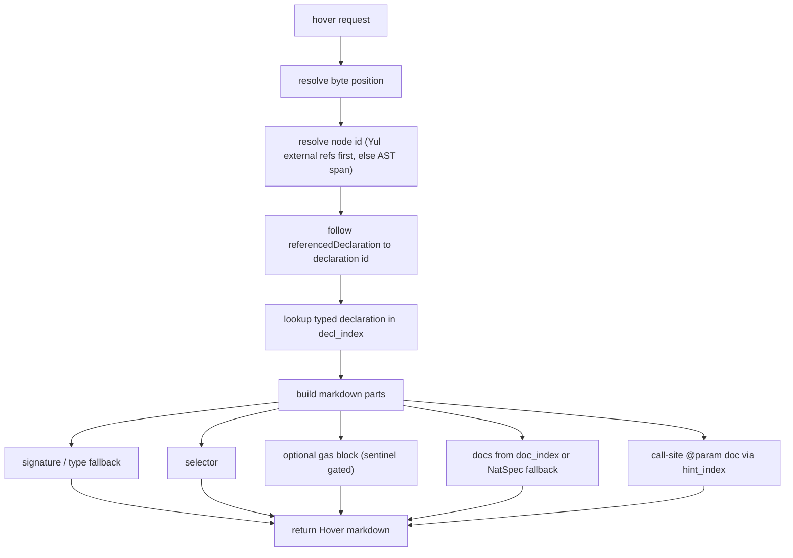

# Hover

## What this page covers

This page describes the current `textDocument/hover` implementation:

- how cursor position resolves to a declaration,
- how signature, selector, gas, and docs are assembled,
- how `@inheritdoc` and call-site `@param` docs are resolved,
- what is covered by tests today.

## Terms used in this page

- **`CachedBuild`**: build-time snapshot (from compiler output on disk) stored as hash maps for fast lookups.
- **`decl_index`**: `HashMap<node_id, DeclNode>` with typed declaration nodes used for O(1) declaration lookup.
- **`doc_index`**: `HashMap<DocKey, DocEntry>` built from `userdoc` + `devdoc` in compiler output.
- **`hint_index`**: prebuilt call-site index used to map a call argument back to `(decl_id, param_name)`.
- **selector**: 4-byte function/error selector or 32-byte event topic shown in hover when available.

## Why hover is built this way

Hover needs to work for multiple cases with one response:

- declaration hover (signature + docs),
- parameter hover (show matching `@param` text),
- argument-at-callsite hover (show docs for the parameter at that call position),
- Yul-linked declarations,
- optional gas estimate display.

A single source is not enough for all of these. The implementation combines typed AST declarations (`decl_index`), doc metadata (`doc_index`), and call-site mapping (`hint_index`).

## Runtime flow

In `src/lsp.rs`, hover is a thin wrapper around:

- `hover::hover_info(&cached_build, &uri, position, &source_bytes)`

Inside `hover_info`, the flow is:

## Cursor to declaration

Resolution order is:

- Try Yul bridge first using `externalReferences`.
- Fallback to AST span match using smallest containing node in the current file.
- Resolve final declaration id by following `referencedDeclaration` when present.

This ensures hover works for both high-level Solidity and inline assembly references.

## Signature and selector

For the resolved typed declaration (`DeclNode`):

- Signature is built with `build_signature()`.
- If no signature is available, hover falls back to `typeString + name`.
- Selector is shown when present:
  - function/public variable/error: 4-byte selector,
  - event: 32-byte topic hash.

## Documentation source priority

Documentation resolution uses this order:

- Use compiler-derived doc index entries first (`userdoc`/`devdoc`).
- Fall back to declaration-level NatSpec extraction.
- For parameter/return variables, fall back to parent declaration param/return docs.

`doc_index` is preferred because it already contains structured docs and compiler-resolved inherited docs where available.

## `@inheritdoc` behavior

If raw doc text contains `@inheritdoc`, the implementation can resolve parent docs by:

- parsing parent name,
- reading the declaration selector,
- finding the parent in base contracts,
- matching by selector in the parent contract declarations.

When resolution succeeds, hover renders resolved content instead of raw `@inheritdoc` lines.

## Call-site parameter doc (argument hover)

Hover also adds parameter doc when the cursor is on an argument at a call site:

- Parse the live buffer and find enclosing call context + argument index.
- Resolve callsite semantics through the prebuilt call index.
- Resolve parameter identity `(decl_id, param_name)`.
- Fetch matching `@param` text from doc index first, then NatSpec fallback.

This allows hover to show meaningful parameter descriptions directly at usage sites.

## Gas estimates in hover

Gas text is added only when all conditions are true:

- gas index is available,
- hovered declaration matches function/contract gas lookup,
- source includes the gas sentinel comment (`@lsp-enable gas-estimates`) for that declaration region.

This is intentional to keep hover lightweight unless explicitly enabled.

## Output shape

Hover markdown is assembled from parts in this order:

- Signature block (or type fallback).
- Selector line when available.
- Optional gas section when enabled and resolvable.
- Documentation section from doc index or NatSpec fallback.
- Optional call-site `@param` detail when applicable.

Parts are separated with blank lines for readability.

## Test coverage and confidence

The hover module has broad direct tests in `src/hover.rs`:

- selector extraction (`function`, `error`, `event`, public variable, no-selector internal),
- `@inheritdoc` resolution and formatting behavior,
- `DocIndex` construction from real fixture (`poolmanager.json`),
- known selector lookup coverage (including overload cases),
- parameter doc extraction behavior.

This gives good confidence for:

- selector correctness,
- docs lookup priority,
- inherited-doc resolution,
- markdown formatting behavior.

### Recommended explicit additions

Useful end-to-end additions through LSP boundary:

- a request-level hover test verifying full assembled markdown ordering,
- a dedicated call-site argument hover test through `lsp.rs` (not just helper-level),
- a gas-sentinel hover test that checks both enabled and disabled paths through request flow.
