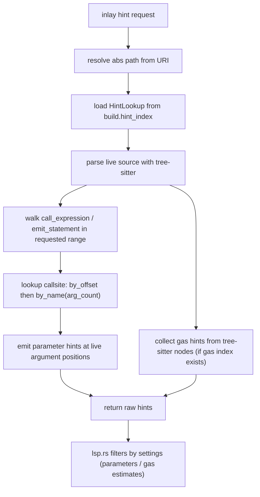

# Inlay Hints

## What this page covers

This page documents the current inlay-hint implementation:

- parameter hints for calls and emits,
- gas hints for functions/contracts,
- how live-buffer positions are kept accurate,
- how settings filter hint kinds at request time.

## Terms used in this page

- **`HintIndex`**: `HashMap<abs_path, HintLookup>` prebuilt from AST at build-cache creation time.
- **`HintLookup.by_offset`**: exact `call_start_byte -> CallSite` map (best when offsets are fresh).
- **`HintLookup.by_name`**: fallback `(name, arg_count) -> CallSite` map (works when offsets drift).
- **`CallSite`**: resolved semantic info for one call shape (`param names`, `skip`, `decl_id`).
- **`skip`**: number of leading params to skip for hint labels (mainly `using for` receiver).

## Why this design exists

Parameter names come from compiler AST semantics, but cursor/argument positions must follow live edits in the editor.  
A single source cannot solve both well.

So the implementation splits responsibilities:

- AST snapshot (`HintIndex`) for semantic mapping,
- tree-sitter on live buffer for real-time argument positions.

## Runtime flow

In `src/lsp.rs::inlay_hint`:

- Read source bytes for the requested URI.
- Load the cached build snapshot.
- Generate raw hints.
- Filter parameter hints (`InlayHintKind::PARAMETER`) and gas hints (`InlayHintKind::TYPE`) based on settings.
- Return hints, or `None` if empty.

Inside `inlay_hints(...)`:

## How callsite mapping is built

`build_hint_index(...)` runs once when `CachedBuild` is created.

For each source file:

- Walk call-like AST nodes (`FunctionCall` and `EmitStatement`).
- Resolve declaration via `referencedDeclaration`.
- Extract parameter metadata from typed declarations.
- Store both exact-offset and name/arity fallback lookup entries.

This is why request-time hinting is mostly lookup work, not full AST recomputation.

## Parameter hint behavior

Hints are emitted for:

- normal function calls,
- member calls,
- emit statements,
- constructor-style `new Contract(args)` when constructor info exists.

Special cases handled:

- **using-for calls**: `skip = 1` when receiver is implicit and arg count is smaller than param count.
- **named-arg struct constructors**: skipped (names are already visible at call site).
- **stale offsets**: fallback to `(name, arg_count)` map.

## Gas hint behavior

Gas hints are generated from tree-sitter node positions and gas index data.  
They are only shown if:

- gas index is non-empty,
- `settings.inlay_hints.gas_estimates` is true,
- and source-level gas sentinel rules match the declaration region.

In request filtering, gas hints are identified by `InlayHintKind::TYPE`.

## Refresh behavior

Inlay hint refresh is triggered asynchronously (`tokio::spawn`) in two places:

- after successful build/update in `on_change`,
- after `did_change_configuration`.

This avoids blocking request/diagnostic flow while still asking the client to re-request hints.

## Known tradeoffs

- Exact offset matching can drift after edits/formatting; fallback improves resilience but can be less precise for overloaded same-name/same-arity cases.
- Request-time accuracy depends on `HintIndex` freshness from the latest successful cached build.
- Filtering happens in `lsp.rs`, so `inlay_hints(...)` may generate more hints than ultimately returned.

## Test coverage and confidence

`src/inlay_hints.rs` includes strong helper-level coverage:

- tree-sitter call/event/name extraction,
- call argument indexing and byte-position mapping,
- `new` expression handling,
- `resolve_callsite_param` behavior (including skip and bounds),
- gas sentinel detection helpers.

This gives good confidence in the core extraction and lookup mechanics.

### Recommended explicit additions

Useful request-level additions:

- end-to-end `textDocument/inlayHint` tests that validate settings filtering by kind,
- stale-offset overload scenario test through request path,
- configuration-change refresh behavior test (ensuring client refresh is triggered).
