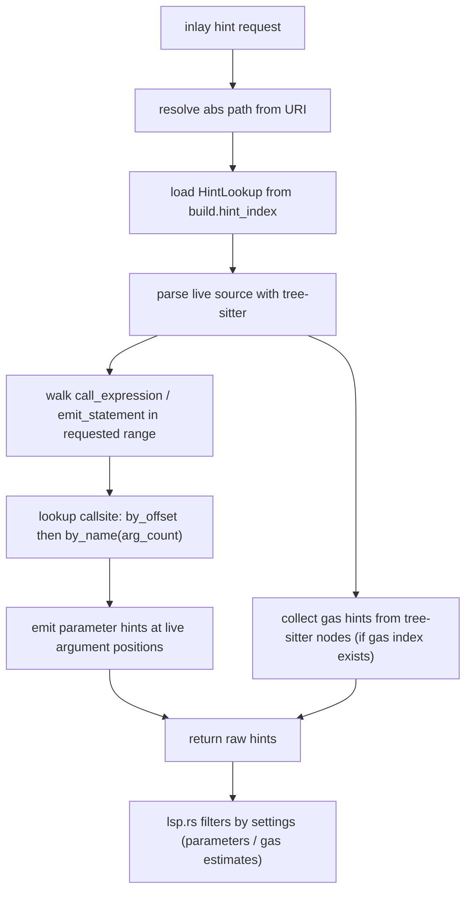

# Inlay Hints

## What this page covers

This page documents the current inlay-hint implementation:

- parameter hints for calls and emits,
- gas hints for functions/contracts,
- how live-buffer positions are kept accurate,
- how settings filter hint kinds at request time.

## Terms used in this page

- **`HintIndex`**: `HashMap<abs_path, HintLookup>` prebuilt from AST at build-cache creation time.
- **`HintLookup`**: public struct with two private lookup maps and two public methods (`resolve_callsite_with_skip`, `resolve_callsite_param`). Callers use the methods, not the maps directly.
  - `by_offset` (private): exact `call_start_byte → CallSite` map (best when AST offsets are fresh).
  - `by_name` (private): fallback `(name, arg_count) → CallSite` map (works when offsets drift).
- **`CallSite`**: private struct with three fields: `info: ParamInfo`, `name: String`, `decl_id: u64`.
- **`ParamInfo`**: private struct nested inside `CallSite` — holds `names: Vec<String>` (parameter names) and `skip: usize`.
- **`ResolvedCallSite`**: public struct returned by `resolve_callsite_param` — holds `param_name: String` and `decl_id: u64`.
- **`skip`**: number of leading params to skip for hint labels (1 for `using-for` library calls, 0 otherwise).
- **`ConstructorIndex`**: `HashMap<u64, ConstructorInfo>` — built as an intermediate from `decl_index` and passed to `build_hint_index()`. Not stored on `CachedBuild`; discarded after the hint index is built.

## Why this design exists

Parameter names come from compiler AST semantics, but cursor/argument positions must follow live edits in the editor.  
A single source cannot solve both well.

So the implementation splits responsibilities:

- AST snapshot (`HintIndex`) for semantic mapping,
- tree-sitter on live buffer for real-time argument positions.

## Runtime flow

In `src/lsp.rs::inlay_hint`:

- Read source bytes for the requested URI.
- Load the cached build snapshot.
- Generate raw hints.
- Filter parameter hints (`InlayHintKind::PARAMETER`) and gas hints (`InlayHintKind::TYPE`) based on settings.
- Return hints, or `None` if empty.

Inside `inlay_hints(...)`:

```mermaid
flowchart TD
  A["inlay hint request"] --> B["resolve abs path from URI"]
  B --> C["load HintLookup from build.hint_index"]
  C --> D["parse live source with tree-sitter"]
  D --> E["walk call_expression / emit_statement in requested range"]
  E --> F["lookup callsite: by_offset then by_name(arg_count)"]
  F --> G["emit parameter hints at live argument positions"]
  D --> H["collect gas hints from tree-sitter nodes (if gas index exists)"]
  G --> I["return raw hints"]
  H --> I
  I --> J["lsp.rs filters by settings (parameters / gas estimates)"]
```

## How callsite mapping is built

`CachedBuild::new()` in `goto.rs` builds the hint index in two steps:

1. **`build_constructor_index(&decl_index)`** — scans `decl_index` for contract declarations with constructors and builds `ConstructorIndex` (`HashMap<contract_id, ConstructorInfo>`). This is a temporary; it is not stored on `CachedBuild`.
2. **`build_hint_index(sources, &decl_index, &constructor_index)`** — for each source file:
   - Walk call-like AST nodes (`FunctionCall` and `EmitStatement`).
   - Resolve declaration via `referencedDeclaration`.
   - Extract parameter metadata from typed declarations (`decl_index`).
   - For `new ContractName(args)` expressions, look up constructor info from `constructor_index`.
   - Store both exact-offset (`by_offset`) and name/arity fallback (`by_name`) entries in `HintLookup`.

`ConstructorIndex` is discarded after `build_hint_index` returns. The final `HintIndex` is stored on `CachedBuild.hint_index`.

This is why request-time hinting is mostly lookup work, not full AST recomputation.

## Parameter hint behavior

Hints are emitted for:

- normal function calls,
- member calls,
- emit statements,
- constructor-style `new Contract(args)` when constructor info exists.

Special cases handled:

- **using-for calls**: `skip = 1` when receiver is implicit and arg count is smaller than param count.
- **named-arg struct constructors**: skipped (names are already visible at call site).
- **stale offsets**: fallback to `(name, arg_count)` map.

## Gas hint behavior

Gas hints are generated inside `inlay_hints()` from tree-sitter node positions and gas index data. Generation is gated on:

- gas index is non-empty,
- source-level gas sentinel is present near the declaration (`/// @custom:lsp-enable gas-estimates` or the shorter `/// lsp-enable gas-estimates` — both match via substring on `GAS_SENTINEL = "lsp-enable gas-estimates"`).

After generation, hints are **filtered in `lsp.rs`** at request time by `InlayHintKind`. Gas hints use `InlayHintKind::TYPE`; parameter hints use `InlayHintKind::PARAMETER`. The `settings.inlay_hints.gas_estimates` toggle is applied in this filter step — not during generation. This means `inlay_hints()` may produce gas hints that are suppressed before the response is returned.

## Refresh behavior

Inlay hint refresh is triggered asynchronously (`tokio::spawn`) in two places:

- after successful build/update in `on_change`,
- after `did_change_configuration`.

This avoids blocking request/diagnostic flow while still asking the client to re-request hints.

## Known tradeoffs

- Exact offset matching can drift after edits/formatting; fallback improves resilience but can be less precise for overloaded same-name/same-arity cases.
- Request-time accuracy depends on `HintIndex` freshness from the latest successful cached build.
- Filtering happens in `lsp.rs`, so `inlay_hints(...)` may generate more hints than ultimately returned.

## Test coverage and confidence

`src/inlay_hints.rs` includes strong helper-level coverage:

- tree-sitter call/event/name extraction,
- call argument indexing and byte-position mapping,
- `new` expression handling,
- `resolve_callsite_param` behavior (including skip and bounds),
- gas sentinel detection helpers.

This gives good confidence in the core extraction and lookup mechanics.

### Recommended explicit additions

Useful request-level additions:

- end-to-end `textDocument/inlayHint` tests that validate settings filtering by kind,
- stale-offset overload scenario test through request path,
- configuration-change refresh behavior test (ensuring client refresh is triggered).
