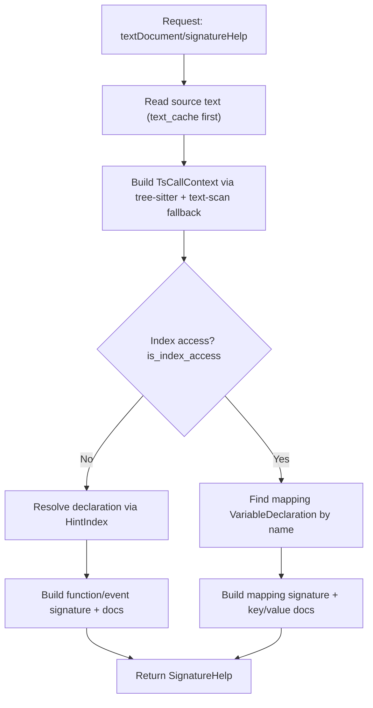

# Signature Help

## Terms used in this page

- **`text_cache`**: in-memory `HashMap<uri, (version, text)>` with current editor text.
- **`HintIndex`**: lookup maps built from AST that connect callsites to declaration IDs.
- **`TsCallContext`**: tree-sitter call context (`name`, `arg_index`, `arg_count`, `is_index_access`, `call_start_byte`).
- **Function/event path**: signature help resolved through AST declaration IDs.
- **Mapping path**: signature help resolved by scanning AST for a mapping variable with the same name.

## What this feature does

`textDocument/signatureHelp` shows:

- the active callable signature
- the currently active parameter
- NatSpec docs when available

The server advertises trigger characters `(`, `,`, `[` in `initialize`.

| Trigger | Typical case |
|---|---|
| `(` | function/event call start |
| `,` | move to next argument |
| `[` | mapping index access |

## Runtime flow



## Step 1: Find call context

The parser path handles both complete and incomplete syntax:

- Normal parse path: try `ts_find_call_at_byte()` to locate `call_expression` / `emit_statement` / `array_access`.
- Parent walk fallback: walk up from the cursor node until one of those enclosing node kinds is found.
- Text-scan fallback: if tree-sitter is incomplete (for example `foo(` while typing), scan text backwards for unmatched `(` or `[` and extract identifier name.

This fallback is why signature help still appears while the user is mid-typing.

## Step 2: Resolve target

### Function/event calls

Call resolution tries:

- exact callsite match: `(call_start_byte, name, arg_count)`
- name fallback: `(name, _)`

It returns `(decl_id, skip)` where `skip=1` is used for `using-for` receiver adjustment.

This matters for calls like:

```solidity
using Transaction for uint256;
uint256 total = PRICE.addTax(TAX, TAX_BASE);
```

The first declared parameter is the implicit receiver (`PRICE`), so highlighting shifts by `skip`.

### Mapping index access

Mapping resolution searches declarations for:

- `nodeType == VariableDeclaration`
- same variable name
- `typeName.nodeType == Mapping`

Then it extracts:

- key type (`keyType.typeDescriptions.typeString`)
- optional key name (`keyName`)
- value type (`valueType.typeDescriptions.typeString`)

Example AST shape used by this path:

```json
{
  "nodeType": "VariableDeclaration",
  "name": "_pools",
  "typeName": {
    "nodeType": "Mapping",
    "keyType": { "typeDescriptions": { "typeString": "PoolId" } },
    "keyName": "id",
    "valueType": { "typeDescriptions": { "typeString": "struct Pool.State" } }
  }
}
```

## Step 3: Build response payload

The server builds `SignatureHelp` with byte-offset parameter labels (not plain text labels), so editor highlighting is exact.

It also attaches docs:

- function/event path: NatSpec `@notice`, `@dev`, `@param` when present
- mapping path: key doc and `@returns <value-type>` text

For `using-for` calls, active parameter is adjusted with `arg_index + skip`.

The byte-range labels are important because editors highlight by offset into the full label string, not by matching parameter text.

## Behavior on incomplete code

Signature help is intentionally resilient while typing:

- `foo(` without closing `)` can still resolve through text-scan fallback.
- `orders[` without closing `]` can still resolve through index-scan fallback.
- when tree-sitter node shapes are incomplete, fallback scanners keep the feature responsive.

## Current limitations

- Overloaded names can fall back to the wrong overload when exact callsite matching is unavailable.
- Nested mapping chains (`a[b][c]`) are currently treated as single-step index access for signature rendering.
- Builtins/type casts without user declarations (`abi.encode`, `uint256(x)`) do not produce declaration-based signatures.

## Test intent

What we need tests to keep guaranteeing:

- call/index context is found correctly on complete and incomplete syntax
- active parameter index is stable across commas and `using-for` offset cases
- mapping signatures include the correct key/value type metadata

## Verify quickly

```bash
# standalone benchmark config for signatureHelp
lsp-bench -c benchmarks/signature-help.yaml

# inspect mapping declarations in a solc AST
jq '[.. | objects | select(.nodeType=="VariableDeclaration" and .typeName.nodeType=="Mapping") | {name, keyName:(.typeName.keyName // ""), keyType:.typeName.keyType.typeDescriptions.typeString, valueType:.typeName.valueType.typeDescriptions.typeString}]' poolmanager.json
```

## Main implementation files

- `src/lsp.rs`: request handling and capability declaration
- `src/hover.rs`: signature payload construction and docs rendering
- `src/inlay_hints.rs`: call-context extraction and text-scan fallback logic
