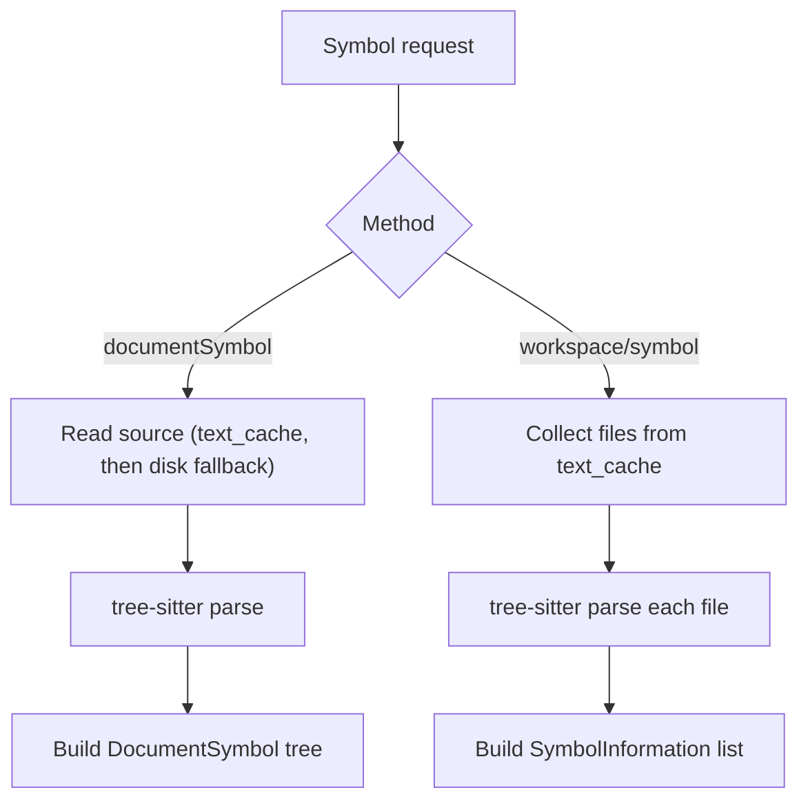

# Symbols

## What this page covers

The server exposes two symbol methods:

- `textDocument/documentSymbol`: hierarchical symbols for one file
- `workspace/symbol`: flat symbol list across files in `text_cache`

Both are tree-sitter based and do not require a successful build.

This means symbols can work even when the file does not compile.

## Terms used in this page

- **Hierarchical symbols**: `DocumentSymbol[]` with parent/child nesting.
- **Flat symbols**: `SymbolInformation[]` with `container_name`.
- **`text_cache`**: in-memory map of open/known files used as the source text set for workspace symbol queries.

## Runtime flow



`documentSymbol` reads current buffer text first (`text_cache`) and falls back to disk only when needed.  
`workspace/symbol` uses files currently available in `text_cache` for fast, repeated lookups.

## Document symbols (`textDocument/documentSymbol`)

The server parses one file and collects top-level nodes. Containers (`contract`, `interface`, `library`, `struct`, `enum`) include children.

Flow:

- Parse Solidity source with tree-sitter.
- Map known top-level node kinds (`contract_declaration`, `function_definition`, `import_directive`, etc.) to symbol builders.
- Recurse into container bodies and attach nested children.

Function nodes include a `detail` string built from parameter and return nodes.

Example:

```solidity
function transfer(address to, uint256 amount) external returns (bool)
```

becomes detail:

```text
(address to, uint256 amount) returns (bool)
```

## Workspace symbols (`workspace/symbol`)

The server parses each cached file and emits a flat `SymbolInformation` list with `container_name`.

This is intentionally cache-scoped for responsiveness; it does not scan every file in the repo on each request.

It is a speed/coverage tradeoff: better latency in the editor, but visibility depends on what files are present in cache.

## Symbol kind mapping (current implementation)

| Solidity construct | SymbolKind |
|---|---|
| `contract` | `CLASS` |
| `interface` | `INTERFACE` |
| `library` | `NAMESPACE` |
| `function` | `FUNCTION` |
| `constructor` | `CONSTRUCTOR` |
| `fallback` / `receive` | `FUNCTION` |
| state variable / struct member | `FIELD` |
| `event` / `error` | `EVENT` |
| `modifier` | `METHOD` |
| `struct` | `STRUCT` |
| `enum` | `ENUM` |
| enum value | `ENUM_MEMBER` |
| `using ... for` | `PROPERTY` |
| `type ... is ...` | `TYPE_PARAMETER` |
| `pragma` | `STRING` |
| `import` | `MODULE` |

## Practical behavior notes

- Broken or partially edited files can still return symbols because this path does not depend on `solc`.
- `fallback_receive_definition` names are synthesized as `fallback` or `receive` from node text.
- Import symbols are rendered as `import "<path>"`.
- For nodes that do not expose a `name` field, symbol extraction falls back to the first `identifier` child.

## Tree-sitter node coverage

Main node kinds currently mapped:

- top-level: `pragma_directive`, `import_directive`, `contract_declaration`, `interface_declaration`, `library_declaration`, `function_definition`, `struct_declaration`, `enum_declaration`, `user_defined_type_definition`
- contract body: `function_definition`, `constructor_definition`, `fallback_receive_definition`, `state_variable_declaration`, `event_definition`, `error_declaration`, `modifier_definition`, `struct_declaration`, `enum_declaration`, `using_directive`
- nested members: `struct_member`, `enum_value`

## Test intent

What tests should keep asserting:

- symbol kind mapping remains stable for core Solidity constructs
- nested container structure is preserved for `documentSymbol`
- flat container labeling remains accurate for `workspace/symbol`

## Verify quickly

```bash
lsp-bench -c benchmarks/shop.yaml
```

Check these rows in the generated report:

- `textDocument/documentSymbol`
- `workspace/symbol`

## Main implementation files

- `src/lsp.rs`: symbol request handling
- `src/symbols.rs`: parsing, node-kind mapping, and tree/flat symbol generation
