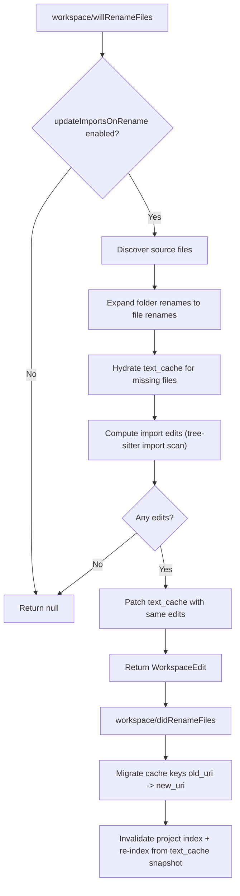

# File Rename Imports (`workspace/willRenameFiles`)

## What this feature does

When a Solidity file is renamed or moved, the server returns import-path edits so dependent files stay valid.

This behavior is controlled by:

- `fileOperations.updateImportsOnRename` (default: `true`)

## Terms used in this page

- **Rename pre-phase**: `workspace/willRenameFiles` request before filesystem rename.
- **Rename post-phase**: `workspace/didRenameFiles` notification after rename.
- **`text_cache`**: in-memory file content map used for edit computation and re-indexing.
- **Folder rename expansion**: converting one folder rename into concrete file-to-file renames for all discovered `.sol` files under that folder.

## Runtime flow



This flow has two independent goals:

- return correct import edits before the rename is finalized
- keep server caches consistent after rename so future requests see the new layout

## What gets updated

- Importers of the renamed file: any project file importing the old path gets a text edit for the import string.
- The moved file itself (when directory changes): its own relative imports are rewritten from the new location.
- Folder renames: folder requests are expanded into per-file renames so nested Solidity files are handled.

Two concrete rename classes are handled:

- same-directory rename (`Pool.sol` -> `Pools.sol`): importers update, file-local imports usually unchanged
- cross-directory move (`src/PoolManager.sol` -> `src/core/PoolManager.sol`): importers update, moved file’s own relative imports can also change

## Why `text_cache` is patched immediately

Editors usually apply the returned `WorkspaceEdit` but do not send `didChange` events for every touched file.  
The server applies those edits to `text_cache` itself to keep internal state consistent until saves happen.

This avoids stale internal state when files were edited indirectly by rename but were never opened as active buffers.

## Client behavior to expect

- The server returns edits.
- The editor applies them in buffers.
- Disk writes depend on editor/file-manager behavior (`:wa` or autosave may be needed).

This is why a rename can look correct in buffers while `forge build` still fails until files are saved.

If your editor does not autosave changed buffers after file operations, run `:wa` (Neovim) or equivalent.

## Current settings and defaults

```json
{
  "solidity-language-server": {
    "fileOperations": {
      "templateOnCreate": true,
      "updateImportsOnRename": true,
      "updateImportsOnDelete": true
    }
  }
}
```

## Limitations

- Remapped external/library imports are not rewritten (`forge-std/...`, `@openzeppelin/...`, etc.).
- Very fast consecutive renames can race with background re-index.
- Folder rename behavior depends on what the client sends in `RenameFilesParams`.
- The server does not write files to disk itself; it returns edits and maintains in-memory state.

## Debug checklist

When a rename appears incomplete:

1. Check LSP logs for `willRenameFiles: ... edit(s)` and `didRenameFiles: re-indexed ...`.
2. Verify editor applied and saved modified buffers.
3. Confirm `fileOperations.updateImportsOnRename` is enabled in client settings.
4. Retry after index completes when running large projects.

## Verify quickly

```bash
# feature behavior
lsp-bench -c benchmarks/pool.yaml

# unit/integration coverage
cargo test --release --test file_operations
```

In Neovim logs (`~/.local/state/nvim/lsp.log`), look for:

- `willRenameFiles: <n> edit(s) across <m> file(s)`
- `didRenameFiles: re-indexed <k> source files`

## Main implementation files

- `src/lsp.rs`: request lifecycle, settings gates, cache migration, and re-index orchestration
- `src/file_operations.rs`: rename expansion, import scanning, edit generation, and cache patching
- `src/links.rs`: tree-sitter import extraction (`ts_find_imports`)
- `src/solc.rs`: project re-index from optional in-memory cache content

## Covered vs not covered

Covered here:

- rename lifecycle (`willRenameFiles` + `didRenameFiles`)
- how edits are computed and why cache patching is required
- practical save behavior in editors

Not covered here:

- deep editor plugin configuration matrices
- every benchmark variant and historical latency table
